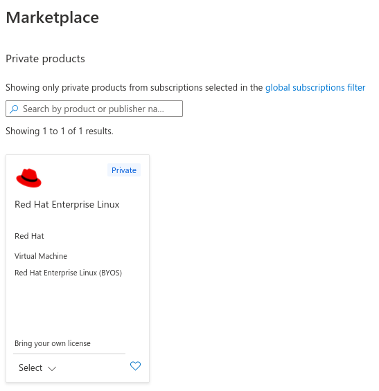

# Enable Cloud Access for Azure

## Part 1: Enable Simple Content Access in your Red Hat Account

Follow the instructions here in the section entitled "How do I enable Simple Content Access for Red Hat Subscription Management?": https://access.redhat.com/articles/simple-content-access#how-do-i-enable-simple-content-access-for-red-hat-subscription-management-2

This will make subscription management a lot easier for you, and is a pre-requisite for Cloud Access (ie BYO subscriptions into Azure)

## Part 2: Install Ansible on a RHEL VM in Azure

You need to do this admittedly annoying pre-requisite step to enable Cloud Access.  However the knowledge will help us later down the track.

1.  Spin up a new RHEL 8 PAYG VM with the Azure account you will be using in the future (any small and cheap machine will do).  You can delete this at the end of this process
2.  Log in to the VM
3.  Install Ansible on it following the instructions here:
https://access.redhat.com/solutions/6375371
```
sudo -i
yum clean all
yum install rhui-azure-rhel8-ansible
yum install ansible
```

## Part 3: Enable Red Hat Cloud Access in your Azure Account

The steps below are a slight modification of what you would be told to do at the following link, with changes to make life easier for you.

1. Go to https://console.redhat.com/settings/sources/new
2. Click Azure
3. Give the source a name, maybe BTAYLOR_Azure_20220310 or something meaningful like that
4. Click the RHEL management bundle
5. Generate the token as requested
6. Copy and save the token *with care* as you will need it later on.  Please note that the token is one very long string that wraps around multiple lines.
7. Run the following commands on your newly built RHEL VM as a regular user that can sudo to root without a password.  The commands below are slightly different to what the online instructions tell you so copy from here, not from the web page.  Remember to paste your token into the second command as one single string.
```
ansible-galaxy collection install redhatinsights.subscriptions

ansible-playbook -i localhost, --connection=local -b  ~/.ansible/collections/ansible_collections/redhatinsights/subscriptions/playbooks/verify_account.yml -e rh_api_refresh_token=<OFFLINE_AUTH_TOKEN>
```
8. Ensure the playbook has run successfully (ie no angry red text on screen)
9. Return to the other window and click "Add"

## Part 3: Check you can see the "Gold Images" in the Azure portal

Based on instructions found here: 
https://access.redhat.com/documentation/en-us/red_hat_subscription_management/1/html-single/red_hat_cloud_access_reference_guide/index#proc_locating-gold-images-azure-portal_cloud-access

1. Log in to the Azure Portal
2. Click the hamburger menu in the top left
3. Click "Create a resource".  Don't worry, we won't be creating another VM
4. Click "Compute"
5. Click "Virtual Machine"
6. Click "See all"
7. Click "Private Products" under Marketplace
8. You will see a box that says Red Hat Enterprise Linux with "Private"

9. If you can see the above, we have successfully configured Cloud Access!

## Final part: Shut down and remove the RHEL VM created at the start

Shut down the VM you created and delete it, as the process is complete
