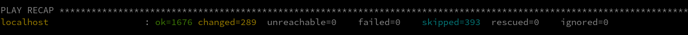

# Harden a RHEL VM to the CIS standard

1. Spin up a new RHEL 8 VM using the Private BYOS RHEL 8 images we now have access to in Azure
2. Log in to the VM
3. Install Ansible

```
sudo -i
yum clean all
yum install rhui-azure-rhel8-ansible
yum install ansible
```

4. Install the SCAP Security Guide package
```
sudo -i
yum install scap-security-guide
```

5. Find the RHEL 8 CIS hardening playbooks
```
cd /usr/share/scap-security-guide/ansible/
ls -la rhel8-playbook-cis*
```

6. Choose whether you want to run the CIS Level 1 Server playbook "rhel8-playbook-cis_server_l1.yml" or the CIS Level 2 Server playbook "rhel8-playbook-cis.yml"

7. Run the playbook
```
ansible-playbook -i "localhost," -c local rhel8-playbook-cis.yml
# or
ansible-playbook -i "localhost," -c local rhel8-playbook-cis_server_l1.yml

```

8. Wait for it to finish.  It will take several minutes to rn because it is checking and changing a lot of the system configuration.
9. Ensure that no tasks FAILED.  The output should look something like what you see here:
