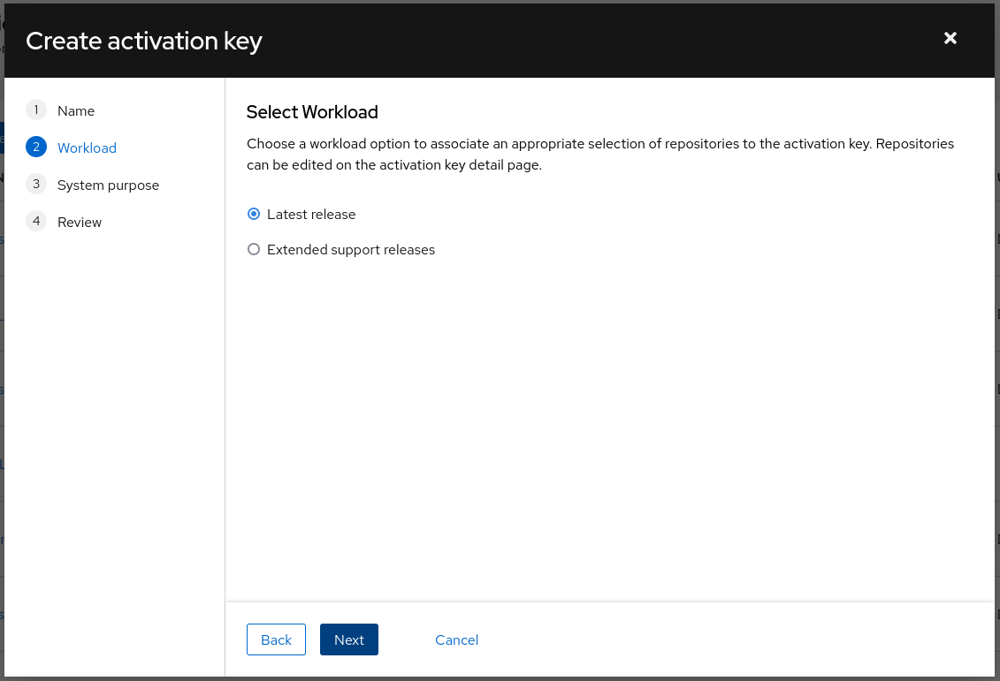
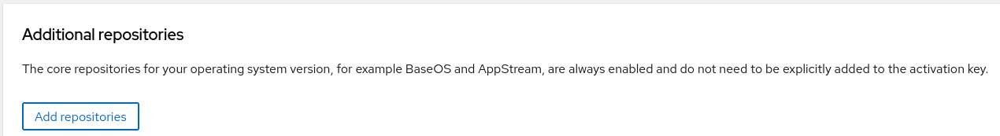
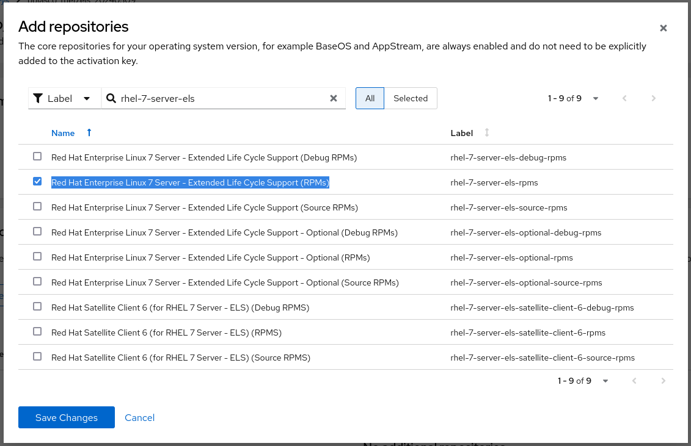
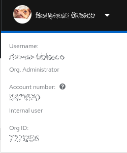

# Enable Red Hat Enterprise Linux (RHEL) 7 Extended Lifecycle Support (ELS) using BYO Subscriptions

## Some background

Red Hat Enterprise Linux 7 reached it's end of support phase on June 30, 2024. Red Hat customers customers who have purchased the Extended Lifecycle Support (ELS) add-on from Red Hat are free to use this both on premises, and in the cloud. Additionally, it can be used for both PAYG (marketplace pay-as-you-go) and BYOS (Bring Your Own Subscription) RHEL in the cloud.

This article describes how to enable RHEL 7 ELS purchased from Red Hat on PAYG RHEL instances in the cloud, but is also applicable to BYOS RHEL on-premises and in the cloud.

Note: This article *does not* describe how to enable RHEL 7 ELS purchased from Cloud Provider Marketplaces

### Check the starting status of our host

Check the status of subscription-manager. PAYG hosts are typically not registered with Red Hat, and should report status "Unknown".

```
[root@bblasco-rhel7-els ~]# subscription-manager status
+-------------------------------------------+
   System Status Details
+-------------------------------------------+
Overall Status: Unknown

System Purpose Status: Unknown

```

Check the repositories enabled on the host. PAYG instances will use Red Hat Update Infrastructure (RHUI) repositories.

```

[root@bblasco-rhel7-els ~]# yum repolist
Loaded plugins: amazon-id, product-id, search-disabled-repos, subscription-manager

This system is not registered with an entitlement server. You can use subscription-manager to register.

repo id                                                        repo name                                                                    status
rhel-7-server-rhui-rh-common-rpms/7Server/x86_64               Red Hat Enterprise Linux 7 Server - RH Common from RHUI (RPMs)                  243
rhel-7-server-rhui-rpms/7Server/x86_64                         Red Hat Enterprise Linux 7 Server from RHUI (RPMs)                           34,476
rhui-client-config-server-7/x86_64                             RHUI Client Configuration Server 7                                                9
repolist: 34,728

```

Check whether subscription-manager is managing repositories for the host. PAYG systems using RHUI will have this set to 0 (zero).
```
[root@bblasco-rhel7-els ~]# grep manage_repos /etc/rhsm/rhsm.conf
manage_repos = 0

```

### Create an activation key with ELS enabled

Log in to the Red Hat Hybrid Cloud Console at [console.redhat.com](console.redhat.com) using your Red Hat ID.

The shortcut to the Activation Keys page is here:
[Activation Keys](https://console.redhat.com/insights/connector/activation-keys)

Create an activation key with "Latest release" as the workload:



Save the activation key, then click on it and select "Add Repositories". Please note that it may take a long time (at least a minute) to load the complete repository list. You can filter on Label with "rhel-7-server-els" to see all related repositories:



Select the "Red Hat Enterprise Linux 7 Server - Extended Life Cycle Support (RPMs)" repository, and any other optional repositories required, then save the changes.



Finally, note the Organisation ID, as this is required for the registration command. This can be found under your name at the top right of the web page.



### Register the system, enable management of repos, and add the ELS repos

First, register the system using the subscription-manager command. This may not be necessary for BYOS systems already registered with Red Hat.

```
[ec2-user@bblasco-rhel7-els ~]$ sudo -i
[root@bblasco-rhel7-els ~]# subscription-manager register --org=<MY_ORG_ID> --activationkey=<MY_ACTIVATION_KEY>
The system has been registered with ID: 7bada824-7ee9-430e-88b3-73ec503f7491
The registered system name is: bblasco-rhel7-els
```

Check whether subscription-manager is able to manage repositories, and then ensure it is set to enabled.

```
[root@bblasco-rhel7-els ~]# grep manage_repos /etc/rhsm/rhsm.conf
manage_repos = 0
[root@bblasco-rhel7-els ~]# 
[root@bblasco-rhel7-els ~]# subscription-manager config --rhsm.manage_repos=1
[root@bblasco-rhel7-els ~]# 
[root@bblasco-rhel7-els ~]# grep manage_repos /etc/rhsm/rhsm.conf
manage_repos = 1
```

Enable the RHEL 7 ELS repository

```
[root@bblasco-rhel7-els ~]# subscription-manager repos --enable rhel-7-server-els-rpms

Repository 'rhel-7-server-els-rpms' is enabled for this system.
[root@bblasco-rhel7-els ~]# 
```

Check that the repository is now enabled on the host.
Note: In the output below you will see a number of repositories "listed more than once in the configuration". You can ignore this warning.

```
[root@bblasco-rhel7-els ~]# yum repolist
Loaded plugins: amazon-id, product-id, search-disabled-repos, subscription-manager
Repository rhel-server-rhui-rhscl-7-rpms is listed more than once in the configuration
Repository rhel-7-server-rhui-debug-rpms is listed more than once in the configuration
Repository rhel-7-server-rhui-extras-rpms is listed more than once in the configuration
Repository rhel-server-rhui-rhscl-7-source-rpms is listed more than once in the configuration
Repository rhel-7-server-rhui-extras-debug-rpms is listed more than once in the configuration
Repository rhel-7-server-rhui-source-rpms is listed more than once in the configuration
Repository rhel-7-server-rhui-rh-common-rpms is listed more than once in the configuration
Repository rhel-7-server-rhui-rpms is listed more than once in the configuration
Repository rhel-7-server-rhui-supplementary-debug-rpms is listed more than once in the configuration
Repository rhel-7-server-rhui-optional-rpms is listed more than once in the configuration
Repository rhel-7-server-rhui-optional-debug-rpms is listed more than once in the configuration
Repository rhel-7-server-rhui-extras-source-rpms is listed more than once in the configuration
Repository rhel-7-server-rhui-optional-source-rpms is listed more than once in the configuration
Repository rhel-7-server-rhui-supplementary-rpms is listed more than once in the configuration
Repository rhel-7-server-rhui-rh-common-source-rpms is listed more than once in the configuration
Repository rhel-server-rhui-rhscl-7-debug-rpms is listed more than once in the configuration
Repository rhel-7-server-rhui-rh-common-debug-rpms is listed more than once in the configuration
Repository rhel-7-server-rhui-supplementary-source-rpms is listed more than once in the configuration
repo id                                                    repo name                                                                        status
rhel-7-server-els-rpms/x86_64                              Red Hat Enterprise Linux 7 Server - Extended Life Cycle Support (RPMs)           34,476
rhel-7-server-rhui-rh-common-rpms/7Server/x86_64           Red Hat Enterprise Linux 7 Server - RH Common from RHUI (RPMs)                      243
rhel-7-server-rhui-rpms/7Server/x86_64                     Red Hat Enterprise Linux 7 Server from RHUI (RPMs)                               34,476
rhel-7-server-rpms/7Server/x86_64                          Red Hat Enterprise Linux 7 Server (RPMs)                                         34,476
rhui-client-config-server-7/x86_64                         RHUI Client Configuration Server 7                                                    9
```

## Conclusion

This procedure lets you enable the RHEL ELS CDN repositories for your systems consuming BYOS ELS. You can now run `yum update` and continue to get security updates according to what is made available in line with the ELS support policy.
